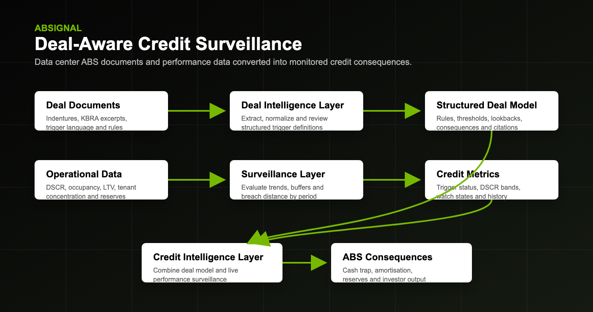
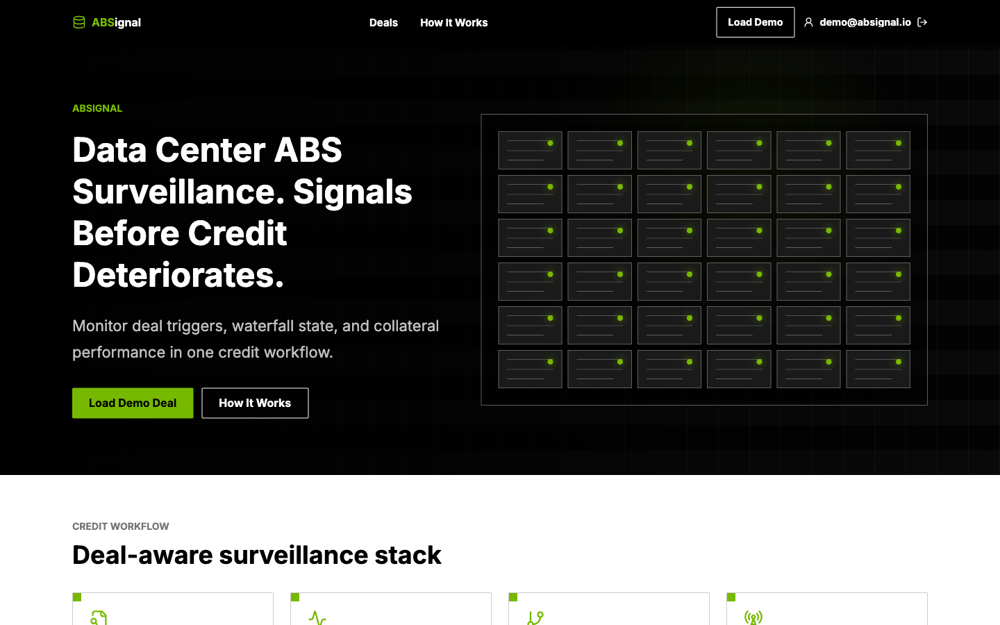
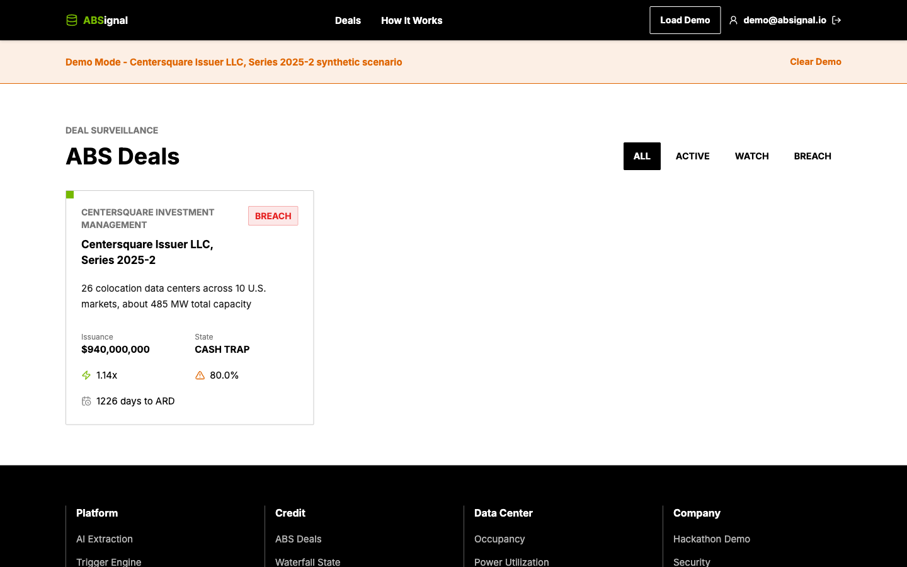
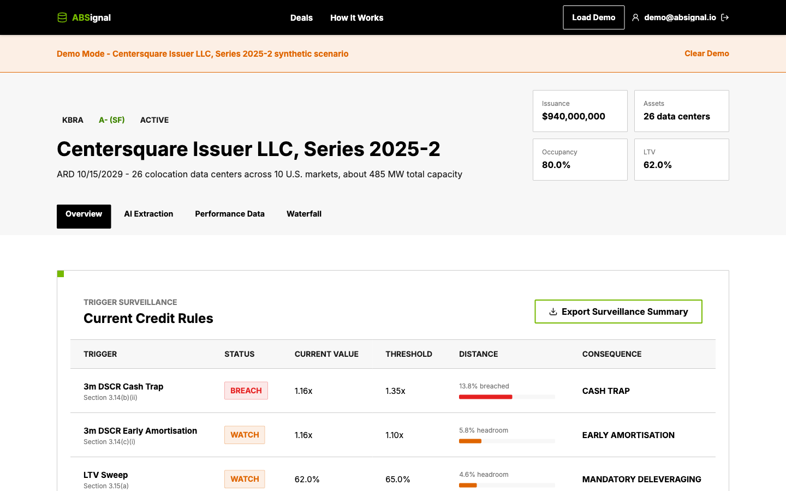
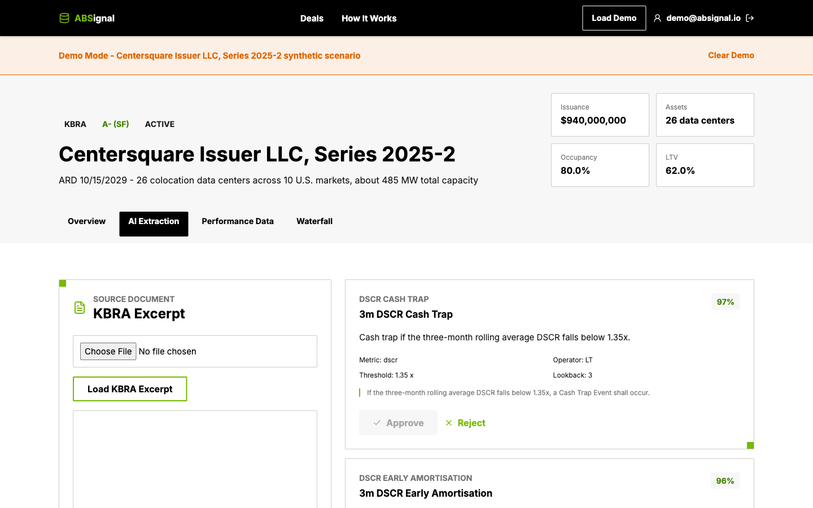
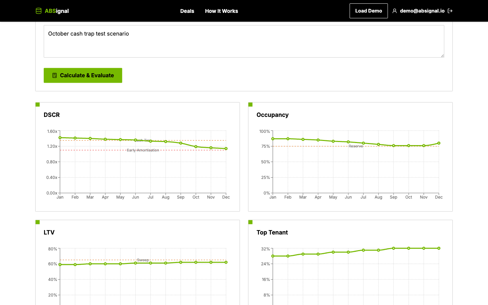
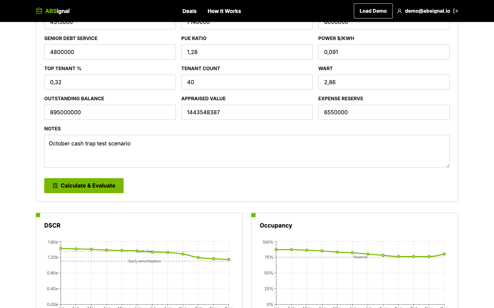
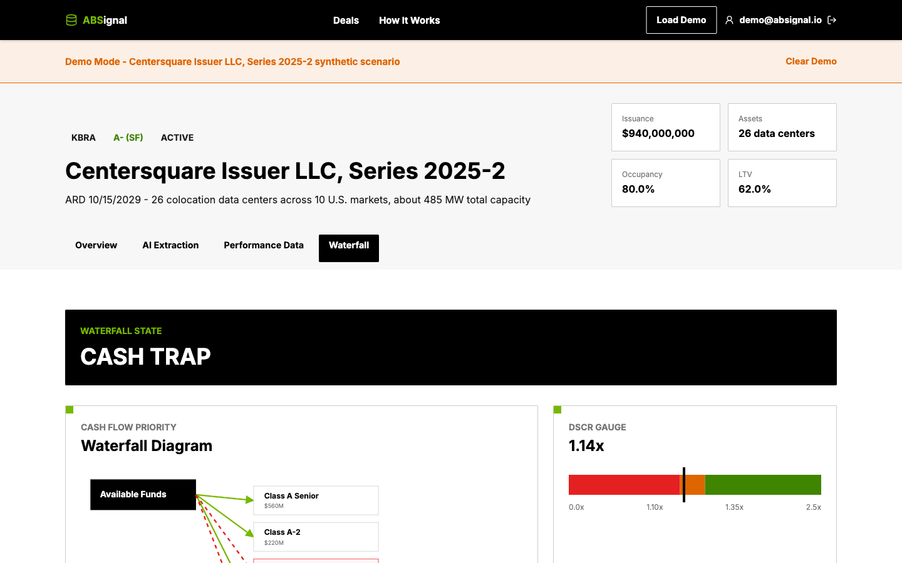

# ABSignal

**Deal-aware credit surveillance for Data Center Asset-Backed Securities**

ABSignal is a hackathon prototype that explores how data center ABS surveillance could connect transaction documents, operating metrics and structured finance analytics in a single credit workflow.



## Overview

ABSignal monitors a synthetic data center ABS transaction and shows how deal-specific rules can be linked to monthly collateral performance. The prototype includes a demo deal, extracted trigger rules, performance snapshots, DSCR and occupancy trends, covenant status checks and a waterfall-state visualization.

The current demo scenario centers on **Centersquare Issuer LLC, Series 2025-2**, a synthetic transaction used to validate the product concept.

## The Problem

Data center ABS credit monitoring sits across several disconnected surfaces:

- Transaction documents define trigger language, thresholds, lookback periods and consequences.
- Operating performance data changes monthly across occupancy, DSCR, LTV, tenant exposure and reserves.
- Structured finance consequences such as cash traps, early amortisation and reserve requirements depend on both documents and live collateral data.

For analysts, the hard part is not just reading performance metrics. It is connecting those metrics back to the exact deal language and understanding the consequence before a trigger becomes a credit event.

## The Solution

ABSignal demonstrates a deal-aware surveillance workflow:

- Extract and review covenant rules from deal text.
- Store rules as a structured deal model.
- Ingest monthly performance snapshots.
- Evaluate trigger status, watch buffers and breach distance.
- Translate rule outcomes into cash-flow and waterfall consequences.
- Export a surveillance summary for analyst review.

## How It Works

1. **Deal documents** are converted into structured trigger rules with thresholds, operators, lookback periods and source references.
2. **Performance snapshots** capture monthly data center and financing metrics such as DSCR, occupancy, LTV, tenant concentration and reserve balances.
3. **Trigger evaluation** compares performance data against each rule and labels results as safe, watch or breach.
4. **Waterfall analysis** maps trigger outcomes to ABS consequences such as cash trap or early amortisation states.
5. **Surveillance output** presents the current rule table and can export a CSV summary.

## Architecture


The prototype is organized around three layers:

- **Deal Intelligence Layer:** extracts and normalizes transaction rules into a structured model.
- **Surveillance Layer:** evaluates monthly performance data against deal-specific thresholds.
- **Credit Intelligence Layer:** combines deal rules and performance metrics to surface ABS consequences.

## Screenshots

### Landing Page



### Main Dashboard



### Deal Overview and Trigger Monitoring



### Covenant Extraction and Review



### Performance Analytics



### Surveillance History



### Waterfall Analysis



## Current Status

ABSignal is a hackathon prototype and research project. The current implementation prioritizes rapid experimentation and concept validation over production-grade architecture.

Implemented in the current prototype:

- Public landing page and demo navigation.
- Demo authentication flow.
- Seeded synthetic data center ABS deal.
- Deal dashboard and deal detail view.
- Trigger and covenant monitoring table.
- Document upload/text extraction workflow with rule review UI.
- Monthly performance snapshot form.
- DSCR, occupancy, LTV and tenant concentration trend charts.
- Snapshot history table.
- Cash trap waterfall-state visualization.
- Supabase schema migrations and demo seed script.

Known limitations:

- The data set is synthetic and limited to one demo transaction.
- Extraction is designed for prototype validation rather than legal-grade document parsing.
- The app does not provide production access controls, audit trails or financial model governance.
- The prototype is not intended to be used for real investment, rating or legal decisions.

## Tech Stack

- **Framework:** Next.js 14, React 18, TypeScript
- **Styling:** Tailwind CSS, custom design tokens
- **Data and auth:** Supabase, Supabase SSR
- **State and data fetching:** Zustand, TanStack Query
- **Tables and charts:** TanStack Table, Recharts
- **Document processing:** PDF parsing, rule extraction helpers
- **Testing:** Vitest, V8 coverage
- **Developer tooling:** ESLint, Prettier

## Running Locally

Install dependencies:

```bash
npm install
```

Create local environment variables:

```bash
cp .env.example .env.local
```

Start the app:

```bash
npm run dev
```

Then open:

```text
http://localhost:3000
```

Useful scripts:

```bash
npm run lint
npm run test
npm run test:coverage
npm run build
npm run backend:check-env
npm run backend:seed
```

The Supabase backend is optional for reviewing the UI concept locally, but required for the persisted seeded demo workflow.

## Disclaimer

This project is intended for educational and prototyping purposes only. It does not provide investment advice, legal advice, credit ratings or production-grade financial analysis.
